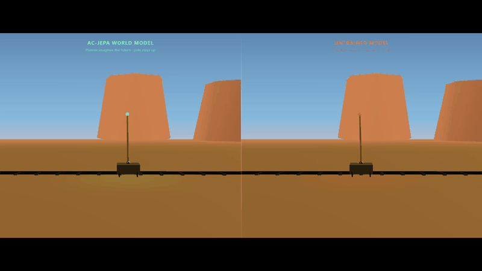
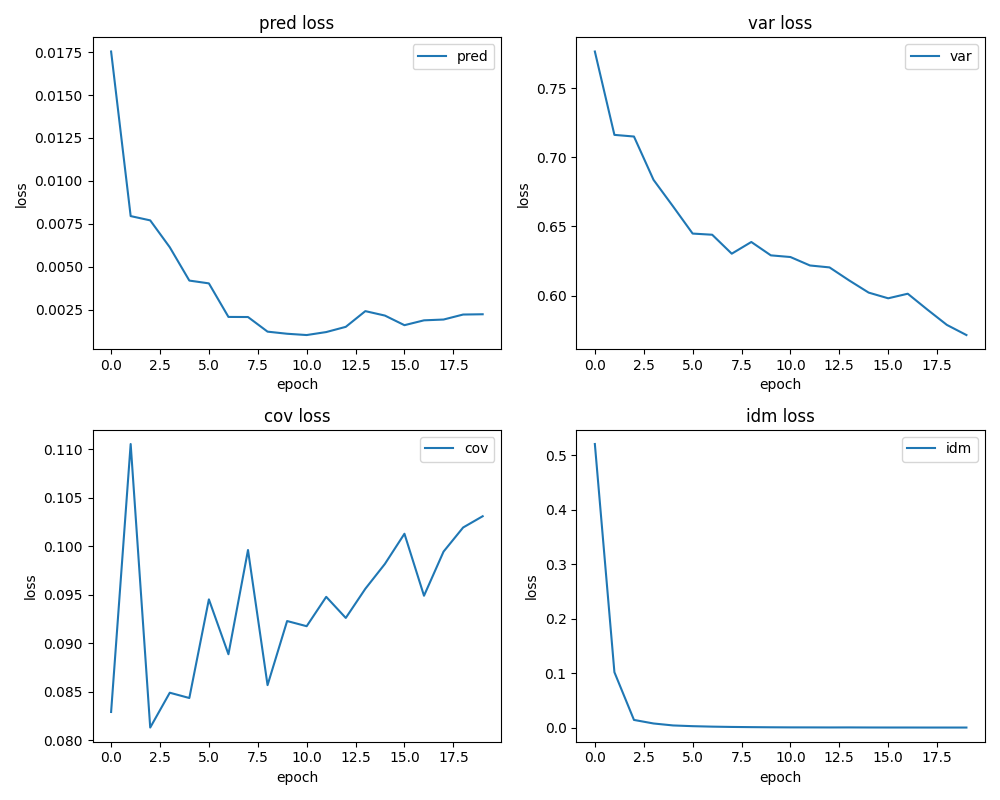

# mini world model

Minimal action-conditioned world model (AC-JEPA style) on CartPole — encoder + GRU predictor trained with VICReg, planned with CEM.



Left: trained model, the pole stays up for 200 steps. Right: same architecture, untrained — the planner is blind, pole falls in under 10 steps.

No RL, no reward shaping, ~600 lines of PyTorch.

---

## How it works

The model learns to predict the future in latent space. At each timestep, CEM samples 1024 action sequences, rolls them forward 20 steps through the model, and picks the one that keeps the pole closest to upright. The world model is what makes the difference — without it, the planner is just guessing.

<details>
<summary>Architecture</summary>

```
TRAINING

  obs_t  →  Encoder (MLP)  →  z_t  →  Predictor (GRU)  →  ẑ_{t+1}
                                                               ↑ MSE ↓
  obs_{t+1}  →  Encoder  →  z_{t+1}  (stop-grad target)

  (z_t, z_{t+1})  →  IDM (MLP)  →  predicted action      (idm_loss)
  z_t, z_{t+1}    →  VICReg                               (var + cov loss)

PLANNING  (model frozen)

  z_0  →  [rollout 1024 sequences × 20 steps]  →  pick best first action
```

VICReg keeps the embedding space from collapsing. IDM grounds it in action-relevant structure. The GRU predictor is what you use at planning time.

</details>

---

## Results

Trained 20 epochs on Kaggle T4 (~30 min).

| | epoch 1 | epoch 20 |
|---|---|---|
| pred_loss | 0.0175 | 0.0023 |
| idm_loss | 0.51 | ~0.000 |
| var_loss | 0.80 | 0.57 |



---

## Run the demo

```bash
pip install -r requirements.txt

# generates viz/trajectory.json (trained) + viz/trajectory_untrained.json
python -m src.plan --export-viz

# launch the Three.js split-screen viz
python -m http.server --directory viz
# → open http://localhost:8000
```

Checkpoint included (`checkpoints/model_ep020.pt`), no training needed. To retrain: `notebooks/kaggle_run.ipynb` on Kaggle.

---

## Repo

```
src/          model, training loop, CEM planner, env helpers
viz/          Three.js split-screen renderer + pre-recorded trajectories
checkpoints/  model_ep020.pt (~420 KB)
notebooks/    kaggle_run.ipynb
assets/       demo.gif, loss_curves.png
```

<details>
<summary>Stack</summary>

| Component | Library |
|---|---|
| World model | PyTorch |
| Environment | Gymnasium (CartPole-v1) |
| Visualization | Three.js |
| Config | PyYAML |

</details>
